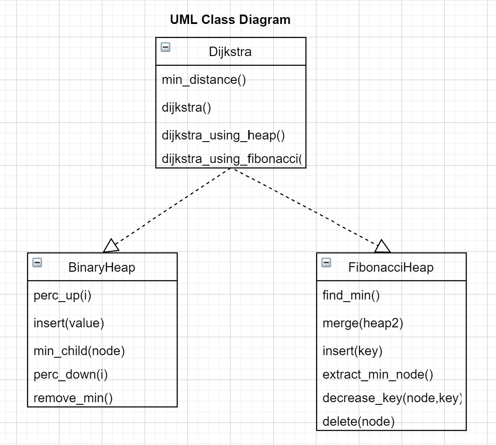

# Report for assignment 4

## Project

Name: keon/algorithms

URL: https://github.com/keon/algorithms

Minimal and clean example implementations of data structures and algorithms in Python 3.

## P+ points
We are aiming at P+ for the assignment and for that we did:

- **Optional (point 1): Architectural overview.** The architecture and purpose of the system are presented in an overview of about 1–1.5 pages. 
- **Optional (point 2): Relation to design pattern(s).** Updates in the source are put into context with the overall software architecture and discussed, relating them to design patterns and/or refactoring patterns.
- **Optional (point 3): Trace tests to requirements.** Relevant test cases (existing tests and updated/new tests related to the refactored code) are traced to requirements
- **Optional (point 4): The patch is clean.** Your patch is clean in that it (a) removes but does not comment out obsolete code and (b) does not produce extraneous output that is not required for your task
- **Optional (point 5): Make a pull request** Patches are accepted by the project, or considered for acceptance 
- **Optional (point 6): Context with best software engineering practice** You can argue critically about the benefits, drawbacks, and limitations of your work carried out, in the context of current software engineering practice, such as the SEMAT kernel.

----

## Onboarding experience

1. How easily can you build the project? 

We managed to build and run the project as documented. Since it is a python project, python 3 obviously had to be installed along with the following dependencies (via pip):

- flake8 
- python-coveralls 
- coverage 
- nose 
- pytest 
- tox 
- black

In general, it was very easy to set everything up since the setup was very well documented. Furthermore, python is quite an easy language to work with.

2. Do you plan to continue or choose another project?

Yes. We will continue with this project.

----

## UML class diagram and its description



The UML class diagram above shows the relevant classes that have been changed or added in this project. It includes all the public functions along with the parameters to give an overview of the class and the class structure.

----

#### Optional (point 1): Architectural overview.

The Open Source project Algorithms is a collection of data structures and algorithms written in Python by contributors. The purpose of the project is to provide a large amount of data structures and algorithms in one place to make it easy to use any of these. Having the project as an open-source project enables people to update and add functionality to ensure the code stays up to date and functioning but also that new data structures and algorithms that people need are added.

It is structured intuitively with three folders and all relevant information about the repository in general, licences, setup and continuous integration in the outermost directory. The three folders consist of an algorithms folder containing the code for algorithms and data structures, a test folder with tests for said code and a docs folder that is supposed to contain generated documentation for each folder inside algorithms (however it seems as most of the documentation is missing). In the algorithm folder, algorithms and data structured are categorized after more general topics, such as matrix, graph, heap etc. Each test file focuses on one category in the algorithms folder. This setup is supposed to facilitate contribution. 

If someone finds that a data structure or algorithm is missing, should be added or modified in any way, they write an issue. In most cases, the ones that write the issues, assign themselves to deal with them right away. The contributors are expected to provide corresponding test cases to the code as well. When adding an algorithm or data structure that does not belong to any already-existing category, they add a new folder with a general category. It is important that all new contributions are only additional and that everything works if excluding it. Hence, no existing code is to be modified or removed due to contribution.  The file with the new algorithm is more specific and sometimes more functions are added in the same file, for instance with different uses of data structures for the same algorithm.

In this assignment, we have resolved an issue in which more alternative implementations of Dijkstra’s algorithm, using other data structures, were requested. We chose to implement Dijkstra’s using a priority queue, both with binary heap and Fibonacci heap. Since the data structure for binary heap already existed in the category folder “Heap”, we only added the function in the “Dijkstra” folder and the relevant test cases in the test_graph file, where Dijkstra's algorithm was already tested. In the case with the Fibonacci Heap, that particular data structure was not included in the “Heap” folder. Therefore, we added the data structure as a new file in that folder and then implemented the use of it in a new function in the Dijkstra’s file. Tests were then added for testing the new data structure and for testing the new function where it was applied. This way of contributing to components separately enables the code to be implemented in other contexts as well. The Fibonacci heap, in case, can then be applied in other algorithms.

---

#### Optional (point 2): Relation to design pattern(s).

The updates to the source code follow the preexisting architecture of the project. As mentioned above under Architectural overview all updates are made to follow said architecture. The two new Dijkstra functions using binary heap and Fibonacci heap are added in the preexisting dijkstra.py file, tests are also added to the previously existing test file test_graph. We also ensure not to make any changes that may interrupt previous source code such as the preexisting Dijkstra function, this ensures that the functionality of these old functions does not change. 

We followed the design patterns of the project such as following the functions naming convention of using snake case. This is where the function name uses underscore “_” instead of capital letters to separate words, an example is the function for Dijkstra’s algorithm that uses a binary heap that was named “dijkstra_min_heap”. This is a common design pattern for python that the project uses. 

Formatting the code according to the design pattern was also done. We used black which is a standard python code formatter which the project uses. This ensures that the format is the same everywhere in the project which improves readability.

----

## Selected issue(s)

Title: "Please add methods in Dijkstra’s algorithm for finding minimum using priority queue (heap module etc.)) #565"

URL: https://github.com/keon/algorithms/issues/565

A version of Dijkstra’s algorithm using a list exists in the project. In order to improve time complexity, more versions should be implemented that use priority queues. We will implement a few different versions namely:
1. Dijkstra's algorithm using the binary min-heap already implemented in the project.
2. Dijkstra's algorithm using a Fibonacci heap.

----

### Project plan

|                               	| fri 	| mon 	| tue 	| wed 	| thu 	|
|-------------------------------	|-----	|-----	|-----	|-----	|-----	|
| Write requirements            	| x   	|     	|     	|     	|     	|
| Write tests                   	|     	| x   	| x   	|     	|     	|
| Implement dijkstra's          	|     	|     	| x   	| x   	|     	|
| Implement Fibonacci heap      	|     	| x   	| x   	| x   	|     	|
| Run coverage report           	|     	|     	|     	|     	| x   	|
| Add tests to improve coverage 	|     	|     	|     	|     	| x   	|
| Write documentation           	|     	| x   	| x   	| x   	| x   	|

----

### Requirements affected by functionality being refactored

#### Dijkstra’s requirements
1. **DIJ-REQ1**: The algorithm should be using a priority queue.
*DIJ-REQ2*: Given an empty graph as input, the function should return an empty array.
2. **DIJ-REQ3**: Given a source and a non-empty graph with no edges as input, the function should return an array with distance to the source itself set to 0 and all remaining distances set to infinity.
3. **DIJ-REQ4**: Given source and non-empty graph the function returns the shortest path to each vertice in the graph.

#### Requirements for Dijkstra's algorithm using min-heap
1. **MIN-REQ1**: Use already existing data structure for binary heap from the project.
2. **MIN-REQ2**: The time complexity should be  O((E+V)log(V))

#### Fibonacci heap requirements:
1. **FIB-REQ1**: FIND MINIMUM NODE

Complexity: Should be constant O(1)

Check 1: If the heap is empty, the minimum node should be none/NULL.

Check 2: Function should return the minimum node (node with the smallest  data)
in the heap.

2. **FIB-REQ2**: FIND AND EXTRACT THE MINIMUM NODE

Complexity: Should be O(logn)

Check 1: Should fetch the minimum node and remove it from the heap. Make sure a new minimum node is selected.

3. **FIB-REQ3**: INSERT

Complexity: Should be constant O(1)

Empty heap inserts:

Check 1: Insert to an empty heap should set the size to 1.

Check 2: Insert to an empty heap should set min_node to the inserted node.

Non-empty heap inserts:

Check 3: Insert to non-empty heap should increase the size by 1.

Check 4: If the inserted node is larger than min_node, it should be unchanged.

Check 5: If the inserted node is smaller than min_node, it should be swapped
for the inserted node.

4. **FIB-REQ4**: DECREASE THE DATA KEY OF A NODE

Complexity: Should be amortised O(1)

Check 1: Decrease the key of the min node. Should just decrease it, no problem.

Check 2: Decrease the child key of min node to a value lower than the min node. Should place the child in the root list and set min node to the child.

Check 3: Run coverage and make more tests.

5. **FIB-REQ5**: MERGE TWO HEAPS

Complexity: Should be constant O(1)

Check 1: The resulting heap's root list should be a concatenation of
 heap1's and heap2's root lists.

Check 2: Merging a heap with an empty heap should not change the
 original heap.

Check 3: Merging an empty heap with a non-empty heap should set
 the min_node to the second heaps min_node.

6. **FIB-REQ6** DELETE NODE

Complexity: O(logn)

Check 1: Delete the root element.

Check 2: Delete a child in a way so that cut and cascade cut is used. Should remove the node but keep the correct structure.

----

#### Optional (point 3): trace tests to requirements.
The tests added for the functions took the requirement in consideration and for all the functional requirements at least one test was created to ensure that we upheld the requirement. Each test created in relation to a requirement is listed below along with the git diff related to the test.

* **DIJ-REQ2**: test_dijkstra_empty_graph in test_graph.py. 
    * git diff ebaeb7a0953eb23a85aa44276af8c23b15cd77e2 tests/test_graph.py
* **DIJ-REQ3**: test_dijkstra_no_edges in test_graph.py. 
    * git diff f2eaf69b16d516c6e6226763da0a88d10238a36c tests/test_graph.py 
* **DIJ-REQ4**: Multiple tests was added
    * test_dijkstra_small_graph in test_graph.py
        * git diff c75b85d8902560aa3d557a6a14340e96b2b327b5 tests/test_graph.py
    * test_dijkstra_large_graph in test_graph.py
        * git diff fd7f4025677717da5d651db03c89cd2ec8296716 tests/test_graph.py

For the requirements that are not possible or reasonable to test using unit tests, such as **DIJ-REQ1**, the algorithm should use a priority queue, we manually ensured that this was the case. Both Dijkstra functions added use priority queues since binary heap and Fibonacci heaps can be used as priority queues. When it came to time complexity we ensured that the methods/data structures were implemented correctly and took for granted that the advertised complexity is correct.

We added tests for the Fibonacci heap according to the aforementioned requirements. See `git diff b9d4c209d95b479057a4a02cc0b6ffdae7fbe24b` for the added tests, where each test method for fib corresponds to a requirement.

----

### Existing test cases relating to refactored code
Since we are implementing a new function and a new datastructure no test cases previously exist. The other version of Dijkstra’s algorithm that doesn’t use priority queue exists and the tests for this function pass. 

**Dijkstras tests**
```
Ran 1 test in 0.000s

OK
```
The test calls the function with a valid arbitrary graph and a valid source and makes sure that the correct distances are returned.

----

### Test results

We added four more Dijkstra’s tests according to the requirements, which was used to test both the binary heap and Fibonacci version. The Fibonacci heap got one test for each public function, see requirements. 

**Dijkstras tests**
```
Ran 5 tests in 0.002s

OK
```

**Fibonacci heap tests**
```
Ran 6 tests in 0.001s

OK
```

----

### Patch/fix
The patch can be seen here: https://github.com/keon/algorithms/pull/639. It includes:
- A new data structure, Fibonacci heap.
- Two new Dijkstra methods, one using a Binary heap and the other using a Fibonacci heap.
- Additional Dijkstra tests.
- Fibonacci heap tests.

----

#### Optional (point 4): the patch is clean.
The patch is clean and does not comment out unused code and does not produce unnecessary output.

----

#### Optional (point 5): considered for acceptance (passes all automated checks).

We have created a pull request to the original repository, see issue https://github.com/keon/algorithms/pull/639.

----

## Effort spent

|                                      | Emma| Diego|Johan | Jonas| Olivia |
|------------------------------    |------    |-------    |-------    |-------    |--------    |
| plenary discussions/meetings 3   |  3        | 3         | 2         | 3          | 3
| discussions                      |  2        |  2         | 2         | 2          | 2          |
| reading documentation (& research)|  3        |  4        | 4       | 3      | 3         | 
| configuration and setup          |  1        |  1         | 1          | 1          | 1           |
| analyzing code/output            |  3       |  2         | 3         | 4          | 3          |
| writing documentation            |  9       |  9         | 8         | 6          | 9           |
| writing code                     |  3       | 3          | 8        |   5        | 5         |
| running code                     |  1       |  1         |  1         |   1        | 1          |
| total                                | 25        | 25         | 27         | 25         | 25          |

----

## Overall experience

#### What are your main takeaways from this project? What did you learn?
One of the main takeaways from this project was time management. It became clear that it takes a lot of time to understand the project and the previously written code. When implementing Dijkstra’s function using binary heap we used a previously existing implementation of a binary heap in the project. It took some time to understand how to use it and if it was going to work in our specific case. Writing tests also take more time than what might be assumed and in general, more time is spent understanding previous code, writing test and documentation than actually writing the code itself.

We also saw the importance of relating the requirements to the finished product both by relating the requirements to unit tests but also in general just going over the requirements after the project was finished to ensure we upheld them. If the tests don't test the requirements it is a risk that some requirements aren’t achieved by the end product. 

Furthermore, we learnt how Fibonacci heaps work, something everyone in the group was unfamiliar with before.

----

#### Optional (point 6): How would you put your work in context with best software engineering practice?

The essence kernel represents the common grounds and defines the key elements of software engineering. It’s formed by alphas, activity spaces, and competences in the three areas of concern representing the essential elements of software engineering:

- Costumer
- Solution 
- Endeavor 

**Alphas**

The alphas represent the important things to work with in software engineering. 

The team first searched for an issue, then figured out its purpose and the stakeholders needs. This goes in line with the Opportunity alpha in the customer area of concern. The team read the issue description to understand the reason why the issue was created, and what the stakeholder needs are.

The “requirements” alpha connected to the solution area of concern, is described as the need that the software system must fulfil to address the opportunity and satisfy the stakeholders. This was also fulfilled since the team first listed the requirements for each issue in order to create a solution that satisfies the stakeholder. Solutions to a customer’s problem is the goal of software engineering. Understanding the requirements before implementation ensures that the team is working in the right direction (stakeholder needs). 

The “work” alpha from the endeavor area of concern is similar to the way the team has worked. The team performed all the physical and mental tasks needed to achieve the desired result, ex: planning, communicating, and performing the work. 

**Activity spaces**

Activity spaces are broad containers of essential activities involved in the kernels 3 areas of concern. The activity space called “understanding stakeholder needs” was half fulfilled since it implies actively engaging with the stakeholders (the person in charge of the repository). The team only had access to the issue description, which was enough to create requirements. The stakeholder had been inactive for a long time, and the team was not expecting a response any time soon. Active communication with the stakeholder could have resulted in a better solution since receiving feedback would contribute to a more satisfied stakeholder. 

Regarding the ”solution” area of concern, the team fulfils the activity space “Understanding the requirements”, since we together listed all the requirements in this document before starting the work. The new feature was implemented, therefore the team also fulfils the activity space “Implements system”. 

Testing is an essential part of software engineering and ensures that the system will work without issue. This is supported by the fact that “test the system” is an activity space in the essence kernel. The team fulfilled this activity by creating and performing unit-tests.

“Coordinate activity” and “track progress”, from the Endeavor are of concern, are two important software engineering activity spaces. The work of the team was coordinated and the progress was tracked. This work is necessary to have a grasp of how much has been done and what needs to be done leading up to the deadline.


